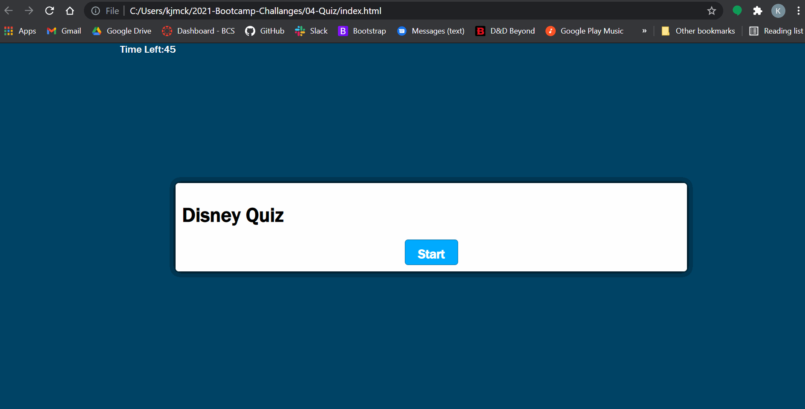

# Disney Quiz
This application is meant to serve as an example of a timed quiz using JavaScript.

## User Story

```
AS A coding bootcamp student
I WANT to take a timed quiz on JavaScript fundamentals that stores high scores
SO THAT I can gauge my progress compared to my peers
```

## App Demo
The following animation demonstrates the application functionality:



## Links

* [GitHub Repo HTTPS](https://github.com/kjmckinley/quiz.git)
* [Deployed Link](https://kjmckinley.github.io/quiz/)


## Resources
- JavaScript
- HTML
- CSS

## Contributors
- Kyle McKinley - GitHub: [kjmckinley](https://github.com/kjmckinley)
